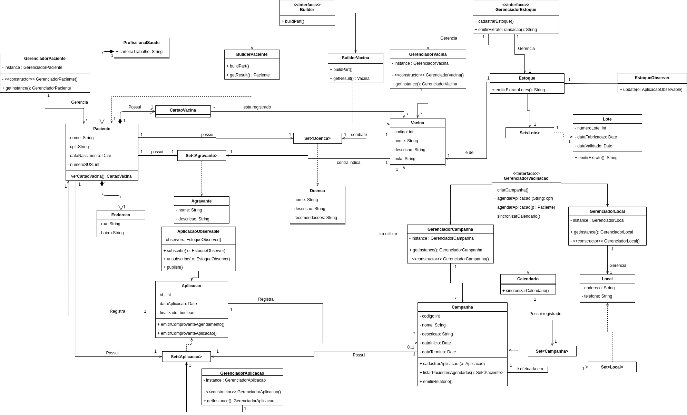

# Diagrama de classe de projeto

## Design Patterns

### Builder 
 Foi utilizado o padrão de construção Builder nas classes Paciente e Vacina graças as varias composições com outras classes 
 (ex: Agravante e Doenca) dificultarem a construção imediata da classe. Com isso, é possível criar as duas classes por etapas, possibilitando a criação de suas composições simultaneamente a sua criação.

### Observer

 Foi utilizado o padrão comportamental Observer nas classes Aplicacao, sendo ela a classe Observable, e Estoque, sendo ela a classe Observer. Esse padrão foi aplicado para que seja notificado quando ocorreu uma aplicação bem sucedida ao estoque,e seja debitado a vacina do mesmo.
### Singleton

Foi utilizado o padrão Singleton em todas as classes concretas de gerenciamento para que n~ao ocorra concorrência dos dados e nem um recarregamento dos mesmos em diferentes partes do código.