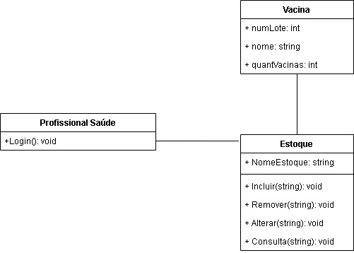
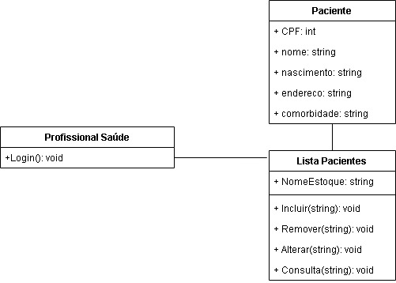
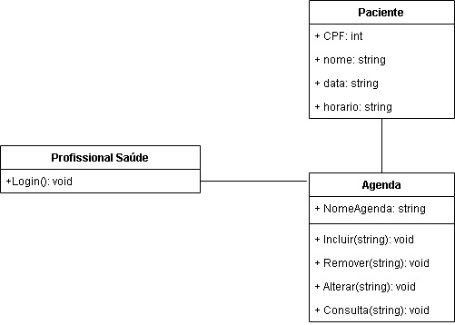
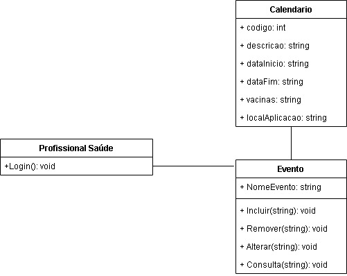

# Visão de Classes Participantes

- **Manter estoque vacinas([CSU00](./CSU00.md)):**:

- **Manter paciente ([CSU01](./CSU01.md))**:

- **Realizar agendamento da aplicação([CSU02](./CSU02.md))**:

- **Manter calendário([CSU03](./CSU03.md))**:

